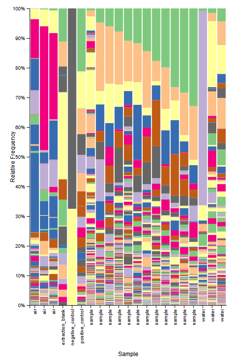
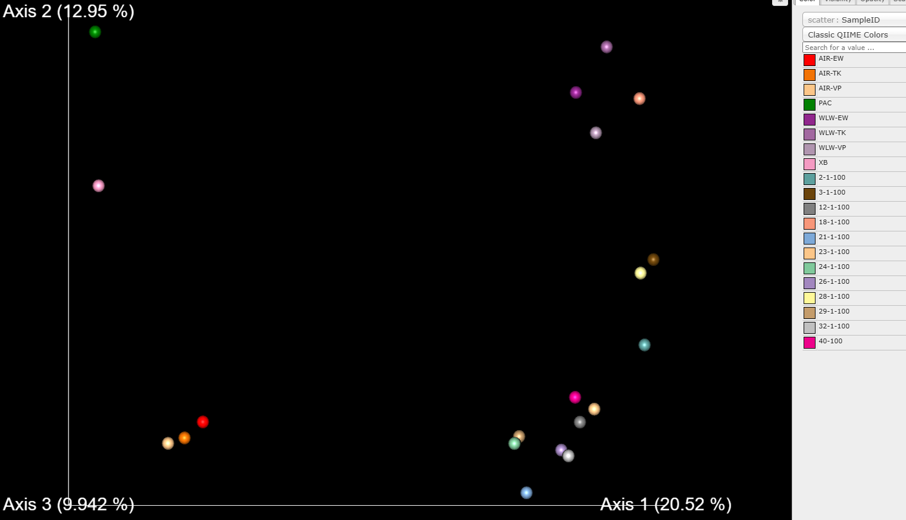
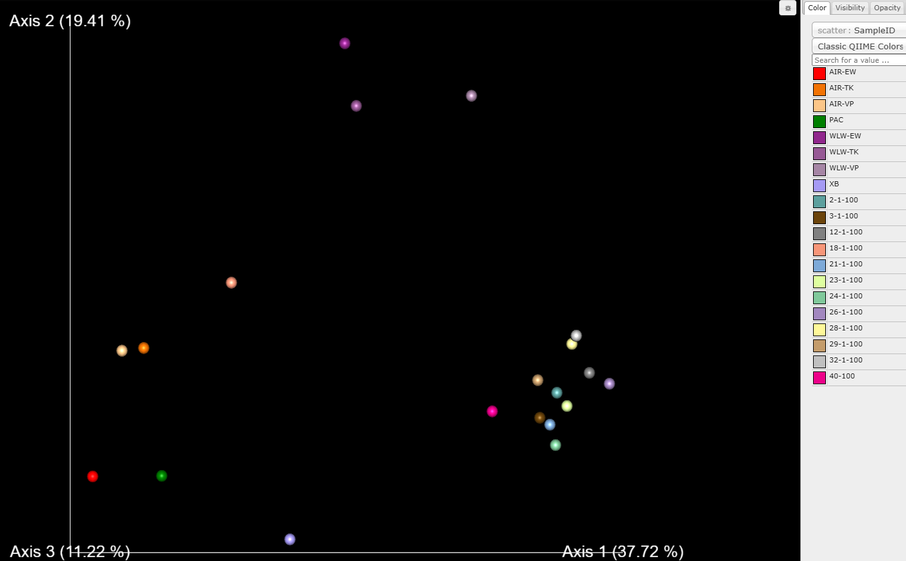

# New England Cyanobacteria Project
## Authors 
Ram Prajapati and Mischa Yurista
## Background
Cyanobacteria (blue-green algae) are photosynthetic prokaryotes found in aquatic environments worldwide. Some species produce cyanotoxins, potent biotoxins that can accumulate in water and pose serious health risks to humans and wildlife. The Lake Tahoe Aerosol Project investigates an emerging concern: pico-scale cyanobacteria that are so small they can aerosolize into water vapor and become airborne (Merrill et al., 2022; doi: https://doi.org/10.3390/ijms22168726). This phenomenon may result in chronic inhalation exposure to biotoxins, potentially contributing to neurological pathologies (Fobel et al., 2014; doi: https://doi.org/10.1212/WNL.88.16_supplement.P5.086).
Our objective was to characterize cyanobacterial communities in aerosol and water samples from New England lakes collected over the summer. By comparing aerosolized samples (AIR) with whole water samples (WLW), we aimed to identify which cyanobacteria are small enough to aerosolize and assess the toxin-producing potential of these communities. 
## Methods
Samples were collected from multiple New England lakes during summer months. We analyzed three types of samples:
AIR-EW, AIR-TK, AIR-VP: Aerosolized water samples, containing bacteria small enough to aerosolize
WLW-EW, WLW-TK, WLW-VP: Filtered whole lake water samples, containing all bacteria including those that do and do not aerosolize
NTC: No template control (negative control)
PAC: Blank control
16S rRNA Sequencing and Data Processing
DNA was extracted from all samples and amplified using 16S rRNA gene primers targeting the V4-V5 hypervariable region. All sequencing was performed, generating paired-end fastq files (*.fastq.gz). Processing was conducted using QIIME2 (Bolyen et al., 2019) and the DADA2 pipeline on the RON computing cluster.
Pipeline overview:

Quality Control (01_trim.sh): PolyG tail filtering and read quality assessment using fastp (Chen et al., 2023). This step removes reads with low quality and filters polyG tails that can occur in Illumina sequencing.
Primer Removal (02_cutadapt.sh): Removal of 16S V4-V5 forward (GTGYCAGCMGCCGCGGTAA) and reverse (CCGYCAATTYMTTTRAGTTT) primers using cutadapt.
Denoising (03_denoise.sh): DADA2 denoising with parameters optimized for 16S V4-V5 amplicons (overlap=10, truncLenF=220, truncLenR=215). This step infers amplicon sequence variants (ASVs).
Taxonomic Classification (04_classify.sh): Classification of ASVs using SILVA 16S reference database (99% identity threshold) with a pre-trained naive Bayes classifier.

All code is version controlled and available in the code/ directory of this repository for reproducibility.
## Findings

Figure 1. Taxonomic composition of cyanobacterial ASVs across sample types. This interactive QIIME2 visualization shows the relative abundance of cyanobacterial taxa across all samples. ASVs were assigned to operational taxonomic units (OTUs) based on 99% sequence similarity to the SILVA reference database. The bar plot highlights relative abundance patterns in aerosolized samples (AIR) versus whole water samples (WLW) from three lakes (EW, TK, VP), demonstrating differential representation of taxa between aerosol and non-aerosol fractions.

Figure 2. Principal Coordinate Analysis (PCoA) using unweighted UniFrac distance metric. This plot reveals differences in cyanobacterial community composition based on the presence/absence of taxa, regardless of abundance. Clear clustering patterns emerge: aerosolized samples (AIR-EW, AIR-TK, AIR-VP in red/orange/tan) cluster distinctly on the left side of the plot, while whole water samples (WLW-EW, WLW-TK, WLW-VP in purple) cluster on the right. This strong separation indicates that aerosol samples contain a fundamentally different set of rare and unique cyanobacterial taxa compared to whole water samples. Controls (PAC in green, and others) appear as expected outliers.

Figure 3. Principal Coordinate Analysis (PCoA) using weighted UniFrac distance metric. This metric incorporates both presence/absence and relative abundance of taxa. Notably, aerosol samples show greater dispersion (spread) than in the unweighted analysis, suggesting variable dominant taxa within the aerosolized community. The overall separation between AIR and WLW samples persists, confirming that abundant cyanobacterial taxa also differ between aerosol and non-aerosol fractions. Axis 1 explains 37.72% of the variance, indicating strong differentiation between sample types based on dominant taxa composition.

Key Observations:

Community-level separation: Both unweighted and weighted UniFrac analyses show clear clustering of AIR vs WLW samples, confirming that cyanobacterial communities in aerosol fractions are fundamentally distinct
Rare taxa composition: The unweighted UniFrac clustering demonstrates that aerosol samples contain unique, less abundant cyanobacterial taxa
Dominant taxa variation: The weighted UniFrac plot reveals that aerosol samples also have variable dominant taxa, suggesting environmental or size-based sorting of the community
Lake-specific patterns: Samples cluster by lake (EW, TK, VP), indicating that each lake maintains a distinct cyanobacterial community signature
Control quality: Sample controls (NTC, PAC) appear appropriately distinct from environmental samples, validating the quality of our analysis
Size-fractionation effect: The consistency of AIR vs WLW separation across both metrics strongly supports the hypothesis that aerosolizable cyanobacteria represent a distinct, size-selected subset of the broader lake community

## References
Bolyen, E., Rideout, J. R., Dillon, M. R., et al. (2019). Reproducible, interactive, scalable and extensible microbiome data science using QIIME 2. Nature Biotechnology, 37(8), 852–857.
Chen, S., Zhou, Y., Chen, Y., & Gu, J. (2023). Fastp: an ultra-fast all-in-one FASTQ preprocessor. Bioinformatics, 34(17), i884–i890.
Fobel, R., et al. (2014). Chronic neurological disease associated to cyanobacterial toxins. Neurology, 88(16 Supplement), P5.086.
Merrill, S., Desai, K., Carney, A., et al. (2022). Small, toxic: cyanobacterial toxins in aerosolized water. International Journal of Molecular Sciences, 22(16), 8726.
